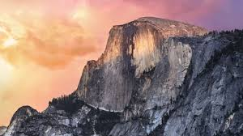
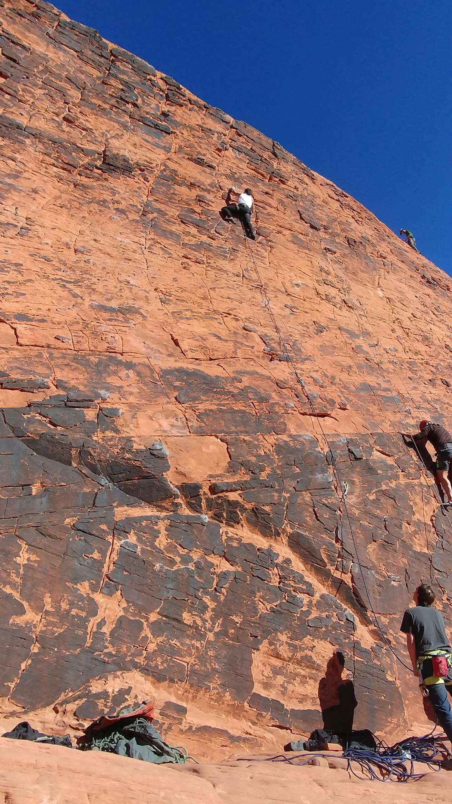
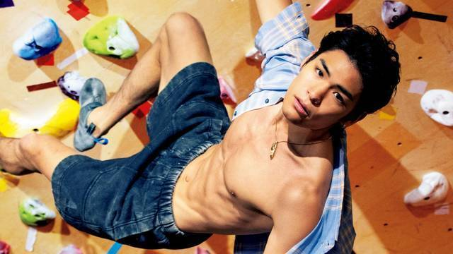
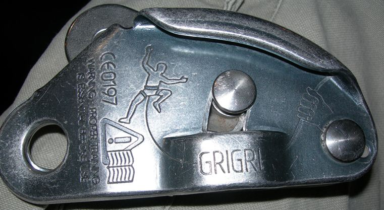
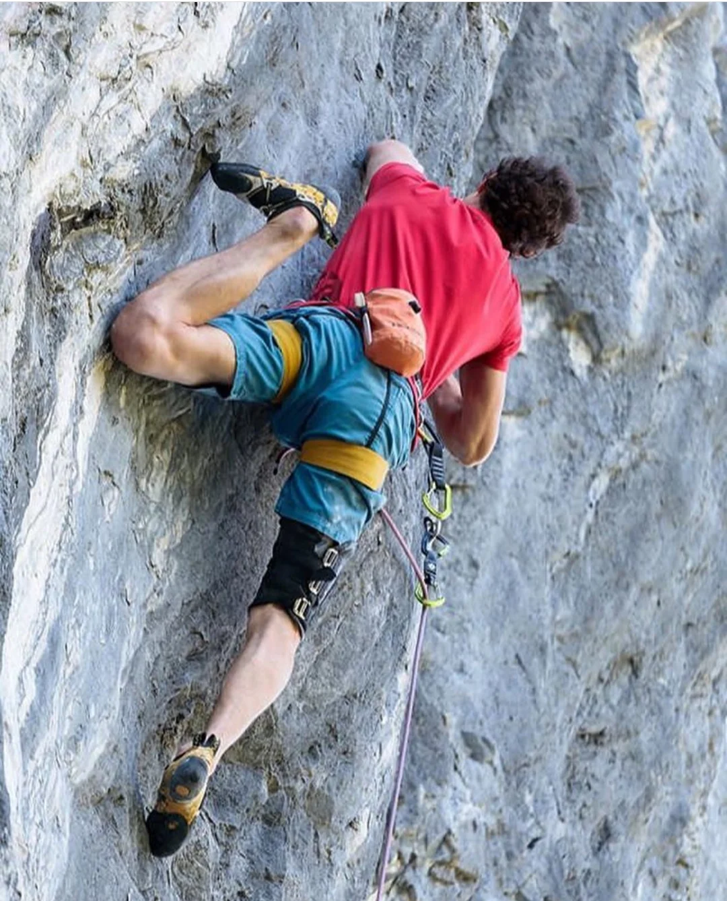
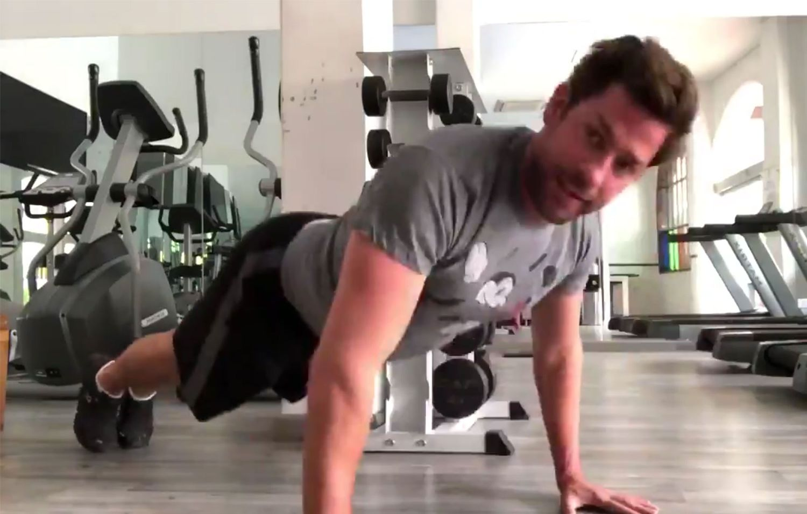

# Rock Climbing at Recurse
## A 15-minute introduction to climbing


```
▅▅▆▂▂▂▅▝▅▅╶▁▂▁▁▄▂▄▘▄
▗▗▄▂▄▁▃▃▉▇▇▃▖▃▃▃▃▅▅▅
▃▂▂▁▃▗▄▂▘▗▊▁▂▂╸▊╷▘┎▅
▃▃▂▃▗▄▗▎▌▆▖▆▄▃▂▘▝▌▖╏
▝▂▂▁▅▆▆▏▁▝▋▃╎▃▘▂▖▍▘▘
╌▎┊▗▂▁▘╲▁▄╷▄▝▚▆┸▘▎╺╷
```

---

# What is Rock Climbing?
- A sport(?) that combines physical strength and mental focus
- Involves ascending natural rock formations or artificial climbing walls
- Can be practiced both indoors and outdoors
- Suitable for all ages and fitness levels


```
╺▝▅▃▁▅▘▗▗▗▗▋
╴╸▅▃▆▅▄▂▁▗▗▗
▘▝▅▆╹╶┒▘▆▄▂╷
▁▝▂▂▇▆▆▇▇▅▅▆
╷▂▅╾▃▃▃▆▁▂▁▄
▇╾┗▃▖▅▇▝▃▄▅▆
▁╺▗▆▅▁┐▂▖▆▋▁
└╍╺╸▁╷╺╴▘▃╷▎
▂▂╺━▄▃▊▂▗▖▖▚
▇▆▅▅▄▃▆▝▅▄┙▄
```

---

# Types of Rock Climbing
1. **Sport Climbing**
   - Pre-bolted routes with permanent anchors
   - Focus on physical difficulty and technique
   - Popular in climbing gyms
   - Quick to set up and take down
   - Great for beginners

2. **Traditional (Trad) Climbing**
   - Climbers place their own protection
   - Requires more technical knowledge
   - More adventurous and self-reliant
   - Strong emphasis on safety
   - Traditional gear (nuts, cams, etc.)


```
▇▁▂▅▊▂▁▖▗╶▃▌▇▍▌▝▂╼▏╸
╶▝▘▆▝━▘▁▄▖▗╸▘╶▆▖╴▋▁▆
▖▇▗▖▘▗▇▇━▉▄╵▗▃▃▇▃▘▝▇
▂▃▁▂▂▂▘▄▗▅╷▉▊▃▖▍▆▗▄▆
▆▇▍▂▗▝▘▋▗▉▄▂▃▗▋▌▆╶▂▘
▖▅▄▄▃▂▁▝▅━▍▊▏▄▗▋▝╵▇▇
```

---

# Beyond the Rock Face
1. **Mountaineering**
   - Combines climbing with hiking and camping
   - Requires knowledge of snow, ice, and weather
   - Often involves high altitudes
   - Team-based expeditions
   - Famous peaks: Everest, K2, Denali

2. **Tree Climbing**
   - Technical climbing in forest environments
   - Specialized equipment for tree protection
   - Popular in areas like Redwood National Park
   - Combines climbing with environmental awareness
   - Unique perspective on forest ecosystems


```
▝▄▂▏▃╸▁▆╿╹▌▗╈▝▂▂▂▖╶▗
▆▄▗▗▝▁▝▘▍▗▁▁▄╻▋▂▄▇▆▇
▅▅▅━╴▃▅┻▎▃▇▇▏┋▆▘─┏▆▁
▅▝▖▏▂┍▅━▋▘╺▏▝▂━▄▄▝▂▂
▃┝▄▅▂╾┑━▘╶▃▋▝▆┙▗▉▆▚▖
▁▁▃▗▅╍▃▃▖▆▗╶╺▆▆▅▖▄▄▂
```

---

# Equipment
- **Harness**: Connects climber to rope
- **Climbing Shoes**: Specialized footwear for grip
- **Rope**: Dynamic rope for safety
- **Carabiners**: Metal loops for connecting gear
- **Helmet**: Protection from falling rocks
- **Chalk**: Improves grip on holds
- **Sling**: For cool things



```
  ╵▃▘▇▇╾╾▃▂▂▁┐▃▁▖▝▚▝
▝▁▘▍▖▆▄▃▂▅▅▅▇▆┕╾▆▃╶▍
▉▚▅╷▌▗▏▆▆▅▃▗▖▍▄▃▇╺▌╶
▇▖▁▁▋▌▇▇▁▁▉▁▂▗▂▖╵▁▇▋
▋╏▁▘▏▏▆▇▍┘▎╷▊▋▉▎╵▆▂▖
▄▂┯▁▂▄▄▄▘▃▅▅▆▂▂▃━▃▃▇
```

---

# Basic Techniques
- **Footwork**: Using edges and smears
- **Handholds**: Crimps, jugs, and slopers
- **Body Position**: Staying close to the wall
- **Route Reading**: Planning your path
- **Rest Positions**: Finding good stances


```
▝╷▘╴╵▃▆▏╶▇▖▗▉▘▉▄▝
┏▘▃▄▗▁▆▝▂▁▏▁▂▁▍▊▉
▗▆┷▃▘▆▅▗▘▎▆▝▂▘▎▖▃
▌▌▗▌╺▗▚▅▖▆▗▁▅▁▊▘▆
┏▎▝▇▆▆▇▝▁▆▅▌▃┅┌┢╾
▗▗╹▅▖▅▖▗┑▎▄▏▘▅▇┗╿
▎▍▌▗▍▁▂▘▗▗▏▊▉▎▃┒▂
▉▘▉▘▘▗▁▂▎▚▖▌╵▖┉▌▘
╵▋▃▊▋▆▋▘▘▍▗▘▎╱╵┛┛
▎▋▝▝▘╽▗▃┏┎┓▋▁▃▍▌▏
```

---

# Safety First
- Always check equipment
- Double-check knots
- Use proper belay techniques
- Follow gym/outdoor area rules
- Climb with a partner
- Know emergency procedures


```
        ▁▂▂         
      ▁▃▖▃▘╴        
    ▁▗▄▗╷ ╷╲╷       
   ▗▗▏▘╷   ╶╶╷      
╷▂▄▃▗▘     ╷╷╵╴     
▆▄▆▗╷       ╷╴╵╴╷   
```

---

# Common Injuries & Prevention
1. **Finger Injuries**
   - Pulley strains and tears
   - Tendonitis
   - Prevention: Gradual progression, proper warm-up

2. **Shoulder Issues**
   - Rotator cuff strains
   - Impingement
   - Prevention: Strengthening exercises, rest days

3. **Knee Problems**
   - Meniscus tears
   - Patellar tendonitis
   - Prevention: Proper foot placement, controlled movements

4. **General Tips**
   - Listen to your body
   - Take rest days
   - Cross-train
   - Stay hydrated
   - Warm up properly


```
▄▄╷▅╵▅╴▝╵▂▂▖▖╵▗▄▃▁▆▆
▇▅▎▇▉▏▘▆▉╌▄▝▂▗╵▄▃▎▇▋
▆╍╌▍▝▖▗▁▁▏▌▌▂▊▁▄┃▏▁▁
▌▄▆▅━▏▇▝▍▄▖▗▁▇▊▄┚▆▆┓
▆▆▁▎▍▖▁▊▗▘▎╸▇▎╿▂━▆▆▆
▄▄╹▊▄▃▄╴▋▚▊▃╶▍▏▊▇▅▄▃
▃▃▄▅▃▂▃▌▏▗▇▄▆▊▁▁┊▌▝▃
```

---

# Benefits of Rock Climbing
- Full-body workout
- Improves problem-solving skills
- Builds confidence
- Reduces stress
- Creates community
- Connects with nature


```
▃▊┚╵▗▃▋┍▃╸┙━▄▄▅▝▘╺▁▃
▗▃▖▖▆▗▘▂▗▘▄▃▍▍▗▄▖▍╶▝
▝▆▌▉▃▘╌▝▇▅▖╵▂▅▘▋▊╾▂▉
▝╺▇▊▗▝╵┛▂▎▝▋▁▏▆▇▁▂▇▗
▉▊▉▋▍▆▅▊▊▚▘▋▊▁▎▃▃▅▎╷
▚▊▏▌▎┬▊▉▋▖▉▃▘▖▋▘▃▂▇▃
▁▋┏▍╵╷╷▋▍▚▂▄▃▃▖▝▗╸▗▝
```

---

# Climbing in NYC
1. **Indoor Gyms**
   - Brooklyn Boulders (Gowanus, Queens)
   - The Cliffs (LIC, Harlem, DUMBO)
   - Vital (Williamsburg, Harlem)
   - GP81
   - Equinox
   - Chelsea Piers (the best)
   - Manhattan Plaza Health Club

2. **Outdoor Options**
   - The Gunks (2 hours north) (the best)
   - Central Park bouldering
   - Highbridge Park
   - Palisades (NJ side)
   - Breakneck Ridge

3. **Climbing Community**
   - NYC Climbing Facebook group
   - Meetup groups
   - Local competitions
   - Weekend trips to the Gunks


```
▅▄▄▄▃▇▄▄▄▃▃▅▅▃▂▍▝▅╺╾
▃▆▅▄▅▅▄▃▁▆▇▅▂┯╵▎▎╹▃╷
▅▅▄▃▂▃▄▃▄▄▄▄▄▄┓▏▁╵╵▂
▄▆▄▃▂▂▇▆▅▄▃▂▃▃▝▆▆▆▏▋
▃▂▂▂▃▃▂▃▃▃▃▃▃▂━▇▅▖▂▂
▃▃▄▄▄▃▃▂▂▂▃▃▃▃▃▃▃▋▂▇
▃▃▅▄▄▄▄▄▄▄▃▄▄▅▅▄▅▋▖┐
```